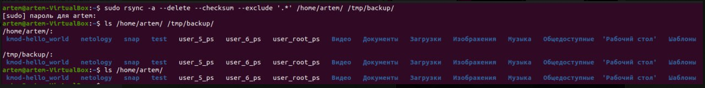
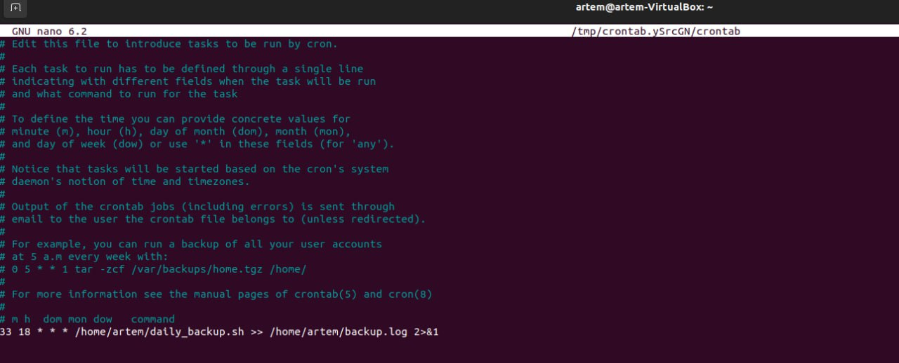
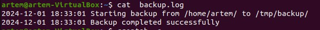

# Домашнее задание к занятию 3 «Резервное копирование»


### Задание 1
- Составьте команду rsync, которая позволяет создавать зеркальную копию домашней директории пользователя в директорию `/tmp/backup`
- Необходимо исключить из синхронизации все директории, начинающиеся с точки (скрытые)
- Необходимо сделать так, чтобы rsync подсчитывал хэш-суммы для всех файлов, даже если их время модификации и размер идентичны в источнике и приемнике.
- На проверку направить скриншот с командой и результатом ее выполнения

### Решение:

1. 

### Задание 2
- Написать скрипт и настроить задачу на регулярное резервное копирование домашней директории пользователя с помощью rsync и cron.
- Резервная копия должна быть полностью зеркальной
- Резервная копия должна создаваться раз в день, в системном логе должна появляться запись об успешном или неуспешном выполнении операции
- Резервная копия размещается локально, в директории `/tmp/backup`
- На проверку направить файл crontab и скриншот с результатом работы утилиты.

### Решение:
1. Создаем скрипт:

```bash
#!/bin/bash

LOGFILE="/home/artem/backup.log"  # Лог-файл (лучше использовать домашнюю директорию для удобства)
SRC="/home/artem/"                # Исходная директория для бэкапа
DEST="/tmp/backup/"               # Целевая директория для бэкапа

# Проверка, существует ли директория назначения
if [ ! -d "$DEST" ]; then
    echo "$(date '+%Y-%m-%d %H:%M:%S') ERROR: Destination directory $DEST does not exist. Exiting." >> "$LOGFILE"
    exit 1
fi

# Логируем начало бэкапа
echo "$(date '+%Y-%m-%d %H:%M:%S') Starting backup from $SRC to $DEST" >> "$LOGFILE"

# Создаем резервную копию с rsync
if rsync -a --delete --checksum --exclude '.*' "$SRC" "$DEST" >> "$LOGFILE" 2>&1; then
    # Если бэкап успешен
    echo "$(date '+%Y-%m-%d %H:%M:%S') Backup completed successfully" >> "$LOGFILE"
else
    # Если бэкап не удался
    echo "$(date '+%Y-%m-%d %H:%M:%S') Backup failed" >> "$LOGFILE"
    exit 1
fi

```
2. Добавляем права на исполнение: chmod +x daily_backup.sh
3. 
4. 

